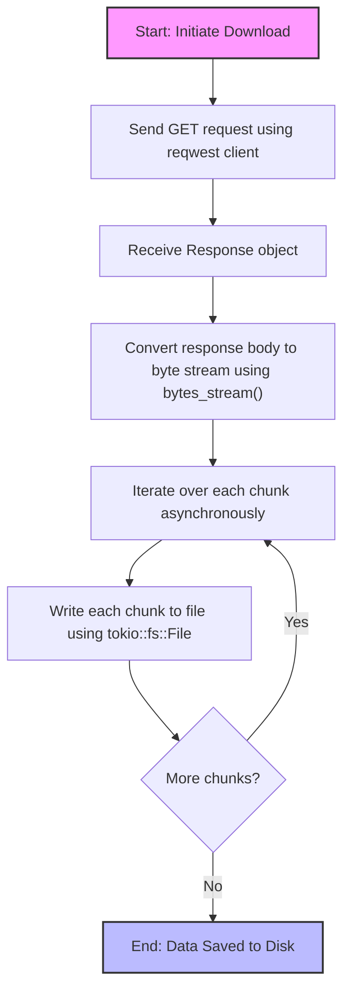

HTTP responses can be quite large and memory consumption can be a concern. In
some cases, it is important to be able to handle large responses without
loading the entire response into memory.

One such scenario is when you want to download a large file from a server. If
you were to load the entire file into memory, it would require a large amount
of memory and would be inefficient. Instead, you can use a streaming approach
to download the file directly to disk.

This example will show you how to do just that using the `reqwest` and `tokio`
crates (Rust). Here is the rough flow.




{/* truncate */}


## Understanding the Streaming Process

In the provided streaming implementation, the key to avoiding loading the entire response into memory lies in **how the response body is processed**. Let's break down the relevant parts of the code:

```rust
// Send the GET request and get the response
let resp = client
    .get(&url)
    .header("User-Agent", "rust-zip-extractor")
    .send()
    .await?
    .error_for_status()?; // Ensure the request was successful

// Convert the response body into a stream of bytes
let mut stream = resp.bytes_stream();

// Iterate over the stream and write each chunk to the file
while let Some(chunk) = stream.next().await {
    let data = chunk?; // Handle potential stream errors
    file.write_all(&data).await?;
}
```

### Key Points:

1. **`send().await?` Does Not Buffer the Entire Response:**
   - The `.send().await?` method initiates the HTTP request and returns a `Response` object **without** reading the entire response body into memory.
   - The response body is **lazy-loaded**, meaning it fetches data incrementally as you process the stream.

2. **Using `bytes_stream()` for Streaming:**
   - The `.bytes_stream()` method converts the response body into a `Stream` of `Bytes` chunks.
   - **Crucially**, this stream processes the response incrementally, allowing you to handle large files without high memory consumption.

3. **Writing Chunks Directly to Disk:**
   - By iterating over `stream.next().await`, you handle each chunk as it arrives and immediately write it to the file.    
   - **`send().await?`**: Initiates the request and prepares to receive the response without buffering the entire body.
   - **`bytes_stream()`**: Explicitly creates a stream that processes the response body chunk by chunk, preventing full buffering.

Therefore, **the provided code does indeed stream the response directly to disk without loading the entire response into memory**.

Full code:

```rust
use reqwest::Client;
use std::path::PathBuf;
use tokio::fs::File;
use tokio::io::AsyncWriteExt;
use uuid::Uuid;
use futures::StreamExt;

/// Async function to download the repository as a ZIP file by streaming the response to disk.
/// Returns the path to the saved ZIP file.
///
/// # Arguments
///
/// * `owner` - The owner of the GitHub repository.
/// * `repo` - The name of the repository.
/// * `reference` - The branch, tag, or commit reference.
///
/// # Errors
///
/// Returns an error if the HTTP request fails or if writing to disk fails.
pub async fn download_repo_as_zip(
    owner: &str,
    repo: &str,
    reference: &str,
) -> Result<PathBuf, Box<dyn std::error::Error>> {
    let url = format!(
        "https://api.github.com/repos/{owner}/{repo}/zipball/{reference}",
        owner = owner,
        repo = repo,
        reference = reference
    );
    let client = Client::new();

    // GitHub requires a User-Agent header
    let resp = client
        .get(&url)
        .header("User-Agent", "rust-zip-extractor")
        .send()
        .await?
        .error_for_status()?; // Ensure the request was successful

    // Generate a unique filename using UUID
    let filename = format!("{}_{}_{}.zip", owner, repo, Uuid::new_v4());
    let filepath = PathBuf::from(&filename);

    // Create the file asynchronously
    let mut file = File::create(&filepath).await?;

    // Convert the response body into a stream of bytes
    let mut stream = resp.bytes_stream();

    // Iterate over the stream and write each chunk to the file
    while let Some(chunk) = stream.next().await {
        let data = chunk?; // Handle potential stream errors
        file.write_all(&data).await?;
    }

    // Ensure all data is written to disk
    file.flush().await?;

    Ok(filepath)
}
```
